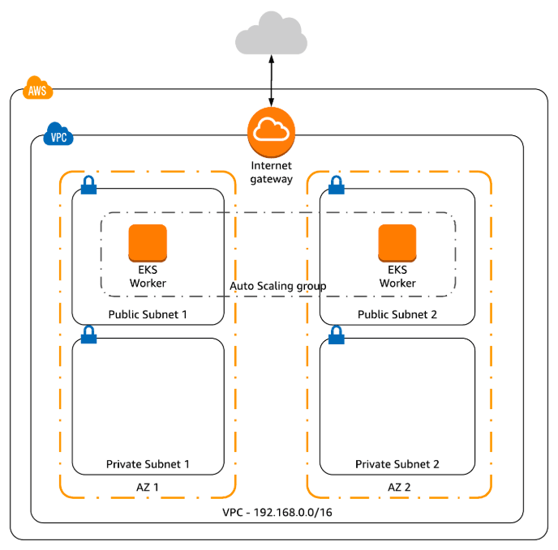
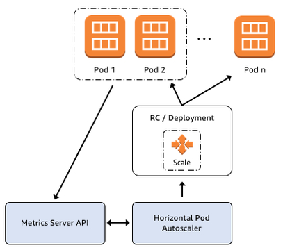

# aws-eks-hpa-autoscale

`aws-eks-hpa-autoscale` is a project that demonstrates the use of AWS EKS (Amazon Web Services Elastic Kubernetes Service). 

The project demonstrates:
* how to install and configure the `eksctl` command
* how to create an EKS cluster using the `eksctl` command
* how to connect to the EKS cluster using `kubectl`
* install a Metrics Server in the EKS cluster
* install a Kubernetes cluster autoscaler
* execute tests to invoke the scaling process

# Architecture diagrams

The diagram below illustrates a high-level overview of AWS EKS.


The `aws-eks-hpa-autoscale` project uses [eskctl](https://docs.aws.amazon.com/eks/latest/userguide/getting-started-eksctl.html) to create the Kubernetes EKS cluster which will result in an architecture similar to that displayed in the diagram below.



The `aws-eks-hpa-autoscale` project uses [HPA](https://kubernetes.io/docs/tasks/run-application/horizontal-pod-autoscale/) (Horizontal Pod Autoscaling) in order to scale the Kubernetes cluster. 

A basic HPA diagram is displayed below.



# Pre-requisites

The following pre-requisities are required in order to work with the `aws-eks-hpa-autoscale` project.

## eksctl
The `aws-eks-hpa-autoscale` project uses [eskctl](https://docs.aws.amazon.com/eks/latest/userguide/getting-started-eksctl.html) to simplify the creation and destruction of the EKS cluster.

The `eksctl` binary can be installed by the commands below:

```bash
# download and extract the eksctl binary
curl --silent --location "https://github.com/weaveworks/eksctl/releases/download/latest_release/eksctl_$(uname -s)_amd64.tar.gz" | tar xz -C /path/to/download

# move the binary to a global location that is part of your $PATH
sudo mv /path/to/download/eksctl /usr/local/bin

# verify that the eksctl binary is installed correctly
eksctl version
```

## aws-iam-authenticator
In order to communicate securely with the EKS cluster you need to install the `aws-iam-authenticator`.

The `aws-iam-authenticator` binary can be installed by the commands below:

```bash
# download the aws-iam-authenticator binary
curl -o aws-iam-authenticator https://amazon-eks.s3-us-west-2.amazonaws.com/1.14.6/2019-08-22/bin/linux/amd64/aws-iam-authenticator

# add execute permissions to the aws-iam-authenticator binary
chmod +x ./aws-iam-authenticator
```

## kubectl
The `kubectl` binary is required to administer the EKC cluster.

Detailed installation instructions can be found at the [AWS Installing kubectl guide](https://docs.aws.amazon.com/eks/latest/userguide/install-kubectl.html).

A quick install guide is provided below:

```bash
# download the kubectl binary
curl -o kubectl https://amazon-eks.s3-us-west-2.amazonaws.com/1.14.6/2019-08-22/bin/linux/amd64/kubectl

# set executable permissions of the kubectl binary
chmod +x ./kubectl

# add kubectl to your $PATH
mkdir -p $HOME/bin && cp ./kubectl $HOME/bin/kubectl && export PATH=$PATH:$HOME/bin

# add the $PATH as a permanent path (assumes your shell is Bash)
echo 'export PATH=$PATH:$HOME/bin' >> ~/.bashrc

# verify that the kubectl binary is installed correctly
kubectl version --short --client
```

# Building the EKS cluster

## Grab the project 

The first step is to git clone the project.

```bash
git clone --verbose --progress https://github.com/damianmcdonald/aws-eks-hpa-autoscale aws-eks-hpa-autoscale 
```

## Configure global variables

The second step is to modify any of the EKS cluster variables to suit your needs.

The global variables are defined in the [aws-deploy.sh](aws-deploy.sh) script.

If you just want to have a sandbox environment to experiment with EKS then the defaults below are probably fine.

```bash
# Global variable declarations
REGION=$(aws configure get region --output text)
EKS_VERSION=1.14
CLUSTER_NAME=workshop
NODEGROUP_NAME=standard-workers
NODE_TYPE=t2.small
NODES_NUM=1
NODES_MIN=1
NODES_MAX=10
ASG_POLICY_NAME=ASG-Worker-Policy
CLUSTER_AUTOSCALER_FILE=$PWD/kubernetes/cluster-autoscaler/cluster-autoscaler.yml
AUTO_SCALING_POLICY_FILE=$PWD/kubernetes/cluster-autoscaler/cluster-policy.json
UNDEPLOY_FILE=aws-undeploy.sh
```

## Create the EKS cluster

Create the EKS cluster by executing the [aws-deploy.sh](aws-deploy.sh) script.

```bash
./aws-deploy.sh
```

As part of the execution of the [aws-deploy.sh](aws-deploy.sh) script, two additional files are dynamically created.

Location | Purpose
------------ | -------------
kubernetes/cluster-autoscaler/cluster-autoscaler.yml | Deploys the `cluster-autoscaler` pod in K8s which is used to dimension and enforce the clusters autoscaling behaviour
aws-undeploy.sh | Script that can be used to destroy and clean-up all of the resources created by the `aws-eks-hpa-autoscale` project

## Verify the EKS cluster
Verify that the EKS cluster has been created successfully.

```bash
# dynamically grab the AWS Region
REGION=$(aws configure get region --output text)

# where --cluster=$CLUSTER_NAME corresponds to the $CLUSTER_NAME that you assigned to your cluster
eksctl utils describe-stacks --region=$REGION --cluster=$CLUSTER_NAME
```

## Configure kubectl to access the EKS cluster

Once the EKS cluster has been created, the final step is to configure and authorize `kubectl` to administer the EKS cluster.

```bash
# where --cluster=$CLUSTER_NAME corresponds to the $CLUSTER_NAME that you assigned to your cluster
eksctl utils write-kubeconfig --cluster=$CLUSTER_NAME
```

# Testing the EKS cluster

The [kubectl-script.sh](kubectl-script.sh) script is provided to walk you through various administrative actions that can be performed with Kubernetes.

See the [kubectl-script.sh](kubectl-script.sh) script (shown below) for specific details.

```bash
#######################################################
# Kubernetes - Cheatsheets
#######################################################

# https://kubernetes.io/docs/reference/kubectl/cheatsheet/
# https://medium.com/faun/kubectl-commands-cheatsheet-43ce8f13adfb

#######################################################
# Demo commands - Hello World
#######################################################

# Deploy a pod in a Deployment
kubectl run hello-world --image=gcr.io/google-samples/hello-app:1.0

# Let's follow our pod and deployment status
# Deployments are made of ReplicaSets!
kubectl get deployment hello-world
kubectl get replicaset
kubectl get pods

# Expose the Deployment as a Serivce.
# This will create a Service for the ReplicaSet behind the Deployment
# We are exposing our serivce on port 80, connecting to an application running on 8080 in our pod.
# Port: Interal Cluster Port, the Service's port. You will point cluster resources here.
# TargetPort: The Pod's Serivce Port, your application. That one we defined when we started the pods.
kubectl expose deployment hello-world --port=80 --target-port=8080

# Check out the IP: and Port:, that's where we'll access this service.
kubectl get service hello-world

# Edit the service to assign a public IP address
kubectl edit service hello-world
# Asign a public IP Address
type: LoadBalancer

# Access the service inside the cluster
curl http://SERVICEIP:PORT

# We can edit the resources "on the fly" with kubectl edit. But this isn't reflected in our yaml. But is
# persisted in the etcd database...cluster store. Change 1 to 3.
kubectl edit deployment hello-world

# Get a list of the pods running
kubectl get pods

# Access the application again, try it several times, app will load balance.
curl http://SERVICEIP:PORT

kubectl delete service hello-world
kubectl delete deployment hello-world
kubectl get all

#######################################################
# HPA horizontal scaling
#######################################################

# install metrics api
helm repo add stable https://kubernetes-charts.storage.googleapis.com/
helm repo update
helm upgrade --install metrics-server stable/metrics-server

# verify install
kubectl get apiservice v1beta1.metrics.k8s.io -o yaml
kubectl get --raw "/apis/metrics.k8s.io/v1beta1/nodes"

# deploy sample app
kubectl run php-apache --image=k8s.gcr.io/hpa-example --requests=cpu=500m --expose --port=80

# create an hpa group
kubectl autoscale deployment php-apache --cpu-percent=20 --min=1 --max=6

# verify the state of the hpa
kubectl get hpa

# watch the hpa scale
kubectl get hpa -w

### Open in new terminal ###

# generate load
kubectl run -i --tty load-generator --image=busybox /bin/sh
while true; do wget -q -O - http://php-apache; done

# clean up
kubectl delete hpa php-apache
kubectl delete service php-apache
kubectl delete deployment php-apache
kubectl delete deployment load-generator
helm uninstall metrics-server
kubectl get all


#######################################################
# Demo commands - Nginx scaleout
#######################################################

# deploy the autoscaler
kubectl apply -f kubernetes/cluster-autoscaler/cluster-autoscaler.yml

# check the logs for the autoscaler
kubectl logs -f deployment/cluster-autoscaler -n kube-system

# install nginx
kubectl apply -f kubernetes/nginx/deployment.yml

# check deployment
kubectl get deployment/nginx-to-scaleout

# scale out the cluster
kubectl scale --replicas=6 deployment/nginx-to-scaleout

# watch the scale out operation
kubectl get pods -o wide --watch

# view the cluster autoscaler logs
kubectl logs -f deployment/cluster-autoscaler -n kube-system

# clean up
kubectl delete deployment nginx-to-scaleout
kubectl get all
```

